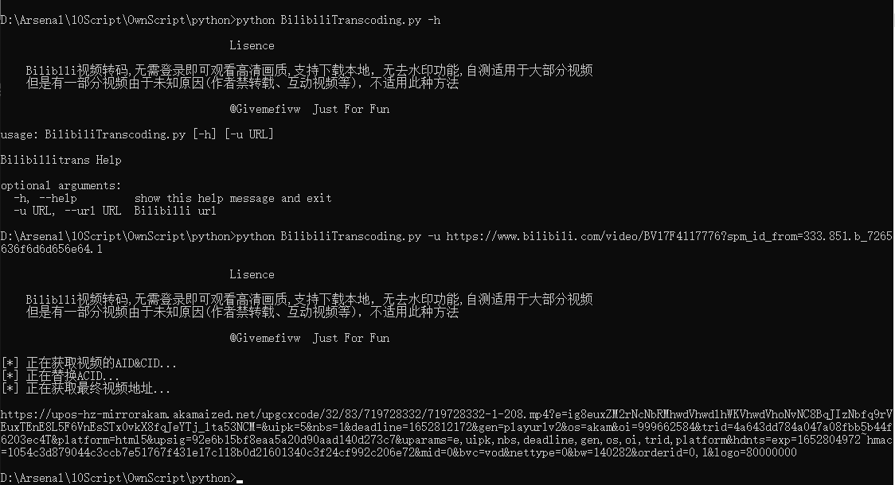
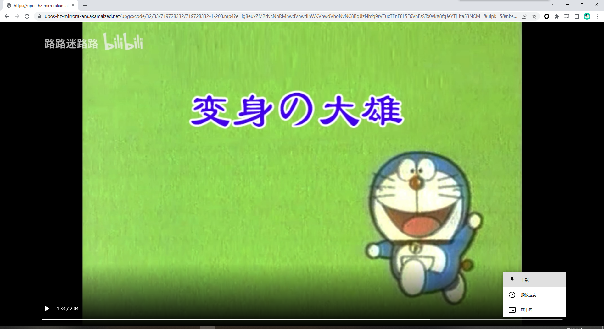
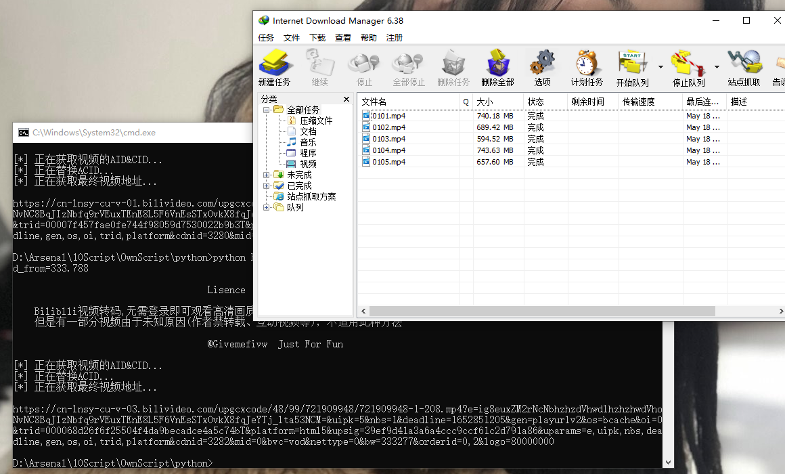

# BilibiliTranscoding
Biliblli视频转码,无需登录即可观看高清画质,支持MP4格式下载本地，无去水印功能,自测适用于大部分视频，网上还有更方便的图形化工具，Just For Fun  仅供娱乐。

首先打开网页B站，选择视频，复制视频链接，运行`python3 BilibiliTranscodeing.py -u http://www.bilibili.com/video/BVXXXXX`

复制得到的最终视频地址网页访问：

### 速度截图

选用IDM下载器对最终地址进行下载，网速足够的情况下，几乎是刚点击保存就下载完成，连速度选项都没来得及截图

### 不足

- 只适合下载单一视频，视频合辑多P内容下，无法像其他工具那样自动识别每一个分P
